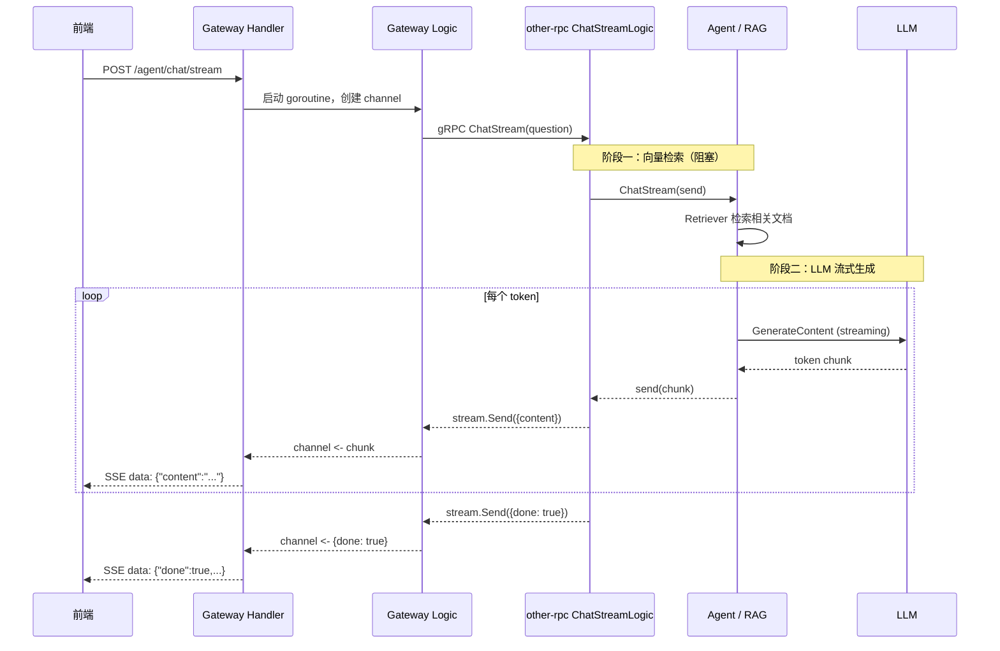

# Agent 流式问答说明

本文档说明当前项目中 **Agent 流式问答** 的完整链路：从浏览器 SSE，到 Gateway，再到 gRPC Server Streaming，最后到 RAG + LLM 逐 token 生成。

---

## 1. 和非流式的区别

| 对比项 | 非流式 `/agent/chat` | 流式 `/agent/chat/stream` |
|--------|----------------------|---------------------------|
| HTTP 响应 | 一次性 JSON | SSE（`text/event-stream`） |
| gRPC | Unary `Chat` | Server Streaming `ChatStream` |
| LLM 生成 | 等全部完成再返回 | 每出一个 token 就推送 |
| 首字延迟 | 较高 | 较低（检索完成后即可出字） |
| 适用场景 | 简单调用、兼容老前端 | 对话 UI、打字机效果 |

**关键点：** 光定义 `ChatStreamChunk` 消息体不等于流式，必须同时满足：

1. Proto 使用 `returns (stream ChatStreamChunk)`
2. 代码里多次 `stream.Send()`，而不是攒完全部答案再发
3. Gateway 用 SSE 边收边推给前端

---

## 2. 整体架构

```
浏览器
  │  POST /agent/chat/stream
  │  SSE: data: {...}\n\n
  ▼
Gateway（BFF）
  │  gRPC ChatStream（Server Streaming）
  ▼
other-rpc
  │  Agent.ChatStream
  │  rag.QA.AskStream
  ▼
LangChainGo RetrievalQA
  ├── 向量检索（阻塞，必须先完成）
  └── LLM 生成（流式，WithStreamingFunc 回调）
```

---

## 3. 时序图



---

## 4. 各层职责

### 4.1 Proto 层（协议定义）

文件：`other-rpc/desc/agent.proto`

```protobuf
rpc ChatStream(ChatRequest) returns (stream ChatStreamChunk);

message ChatStreamChunk {
  string content = 1;      // 增量文本
  bool done = 2;           // 是否结束
  string session_id = 3;   // 会话 ID（RPC 层可选，Gateway 补充）
  string message_id = 4;   // 消息 ID（RPC 层可选，Gateway 补充）
}
```

- `stream` 关键字：gRPC **服务端流式**
- `content`：每次推送的增量内容
- `done`：结束标记，由 `ChatStreamLogic` 在生成完成后发送

---

### 4.2 RAG 层（token 来源）

文件：`other-rpc/internal/agent/rag/qa.go`

```go
func (q *QA) AskStream(ctx context.Context, question string, send func(chunk string) error) error {
    _, err := chains.Run(ctx, q.chain, question, chains.WithStreamingFunc(
        func(ctx context.Context, chunk []byte) error {
            return send(string(chunk))
        },
    ))
    return err
}
```

执行过程：

1. `RetrievalQA` 先调用 Retriever 做向量检索（**这一步不能流式**）
2. 检索结果拼进 Prompt
3. LLM 开始生成，每出一个 token 触发 `WithStreamingFunc` 回调
4. 回调通过 `send(chunk)` 向上传递

文件：`other-rpc/internal/agent/agent.go`

```go
func (a *Agent) ChatStream(ctx context.Context, question string, send func(chunk string) error) error {
    return qa.AskStream(ctx, question, send)
}
```

---

### 4.3 RPC 层（gRPC 流式发送）

文件：`other-rpc/internal/logic/chat_stream_logic.go`

```go
func (l *ChatStreamLogic) ChatStream(in *agent.ChatRequest, stream agent.Agent_ChatStreamServer) error {
    err := l.svcCtx.Agent.ChatStream(l.ctx, question, func(chunk string) error {
        return stream.Send(&agent.ChatStreamChunk{Content: chunk})
    })
    if err != nil {
        return status.Errorf(codes.Internal, "...")
    }
    return stream.Send(&agent.ChatStreamChunk{Done: true})
}
```

每收到一个 token → 立刻 `stream.Send`  
全部完成 → 发 `{done: true}`

---

### 4.4 Gateway Logic（gRPC → channel）

文件：`gateway/internal/logic/agent/agent_chat_stream_logic.go`

```go
stream, err := l.svcCtx.Agent.ChatStream(chatCtx, &agent_client.ChatRequest{
    Question: question,
})

for {
    chunk, err := stream.Recv()
    // ...
    client <- &types.AgentChatStreamChunk{
        Content:   content,
        SessionId: sessionId,
        MessageId: messageId,
    }
}
```

职责：

- 生成 `session_id`、`message_id`（Gateway 侧维护，不依赖 RPC）
- 消费 gRPC stream，转成 Go channel 消息

---

### 4.5 Gateway Handler（channel → SSE）

文件：`gateway/internal/handler/agent/agent_chat_stream_handler.go`

路由定义：`gateway/desc/agent/agent.api`

```api
@server (
    group: agent
    sse:   true
)
service Gateway {
    @handler AgentChatStream
    post /agent/chat/stream (AgentChatReq) returns (AgentChatStreamChunk)
}
```

Handler 核心逻辑：

```go
client := make(chan *types.AgentChatStreamChunk, 16)

// goroutine：Logic 往 channel 写
threading.GoSafeCtx(r.Context(), func() {
    defer close(client)
    l.AgentChatStream(&req, client)
})

// 主 goroutine：从 channel 读，写 SSE
for {
    select {
    case data := <-client:
        json.Marshal(data)
        fmt.Fprintf(w, "data: %s\n\n", output)
        flusher.Flush()   // 立刻推给浏览器
    case <-r.Context().Done():
        return
    }
}
```

`sse: true` + `rest.WithSSE()` 会自动设置：

- `Content-Type: text/event-stream`
- `Cache-Control: no-cache`
- `Connection: keep-alive`

---

## 5. SSE 数据格式

### 请求

```http
POST /agent/chat/stream
Content-Type: application/json

{
  "question": "介绍一下这个项目",
  "session_id": "可选，不传则自动生成"
}
```

### 响应（流式）

```text
data: {"content":"你好","session_id":"abc","message_id":"xyz"}

data: {"content":"，我是","session_id":"abc","message_id":"xyz"}

data: {"done":true,"session_id":"abc","message_id":"xyz"}
```

### 字段说明

| 字段 | 含义 |
|------|------|
| `content` | 本次推送的增量文本，可能是一个字或一个词 |
| `done` | `true` 表示本轮回答结束 |
| `session_id` | 会话 ID，Gateway 生成或沿用请求里的值 |
| `message_id` | 本轮消息 ID，Gateway 生成 |

---

## 6. 测试命令

```bash
curl -N -X POST http://localhost:9000/agent/chat/stream \
  -H "Content-Type: application/json" \
  -d '{"question": "介绍一下这个项目"}'
```

`-N` 关闭 curl 缓冲，才能实时看到 SSE 输出。

---

## 7. 前端消费示例

POST 请求不能用原生 `EventSource`（只支持 GET），推荐 `fetch`：

```javascript
const resp = await fetch("/agent/chat/stream", {
  method: "POST",
  headers: { "Content-Type": "application/json" },
  body: JSON.stringify({ question: "你好" }),
});

const reader = resp.body.getReader();
const decoder = new TextDecoder();
let buffer = "";

while (true) {
  const { done, value } = await reader.read();
  if (done) break;

  buffer += decoder.decode(value, { stream: true });
  const lines = buffer.split("\n\n");
  buffer = lines.pop();

  for (const block of lines) {
    const line = block.trim();
    if (!line.startsWith("data: ")) continue;
    const data = JSON.parse(line.slice(6));
    if (data.content) {
      appendToUI(data.content);  // 追加到对话框
    }
    if (data.done) {
      console.log("回答结束", data.session_id, data.message_id);
    }
  }
}
```

---

## 8. 注意事项

### 8.1 检索阶段仍有等待

RAG 必须先完成向量检索，才能开始 LLM 生成。  
所以用户点击发送后，**首 token 前**会有一段检索耗时，这是正常现象。

### 8.2 超时配置

`gateway/etc/gateway-docker.yaml`：

```yaml
Timeout: 120000        # HTTP 超时（毫秒）
AgentRpc:
  Timeout: 120000      # gRPC 超时（毫秒）
```

流式接口比普通接口耗时长，需要适当调大。

### 8.3 Nginx 反代

如果 Gateway 前面有 Nginx，需要关闭缓冲：

```nginx
proxy_buffering off;
proxy_cache off;
chunked_transfer_encoding on;
```

否则 SSE 会被 Nginx 攒一批才下发，看起来像「假流式」。

### 8.4 客户端断开

用户关闭页面时，`r.Context().Done()` 会触发，Handler 退出。  
建议后续可在 RPC 层监听 `stream.Context().Done()`，及时 cancel LLM 请求，避免浪费算力。

### 8.5 假流式陷阱

以下写法**不是真流式**：

```go
// 错误：等 LLM 全部生成完，再一次性 Send
answer := generateFullAnswer()
stream.Send(&ChatStreamChunk{Content: answer, Done: true})
```

正确做法：在 `WithStreamingFunc` 回调里，每收到 chunk 就 `Send` 一次。

---

## 9. 相关文件索引

| 层级 | 文件 |
|------|------|
| Proto | `other-rpc/desc/agent.proto` |
| RAG 流式 | `other-rpc/internal/agent/rag/qa.go` |
| Agent 入口 | `other-rpc/internal/agent/agent.go` |
| RPC Logic | `other-rpc/internal/logic/chat_stream_logic.go` |
| RPC Server | `other-rpc/internal/server/agent_server.go` |
| gRPC Client | `other-rpc/agent_client/agent.go` |
| API 定义 | `gateway/desc/agent/agent.api` |
| Gateway Logic | `gateway/internal/logic/agent/agent_chat_stream_logic.go` |
| Gateway Handler | `gateway/internal/handler/agent/agent_chat_stream_handler.go` |
| 路由注册 | `gateway/internal/handler/routes.go` |

---

## 10. 重新生成代码

修改 Proto 后：

```bash
cd other-rpc && make agent-protos
```

修改 Gateway API 后：

```bash
cd gateway && make gateway-code
```
